# 🚀 GenAI SaaS Platform

[](https://www.mongodb.com/mern-stack)  
[](https://vercel.com)  
[](https://render.com)  
[](https://stripe.com)  
[](https://openai.com)  

GenAI SaaS is a **MERN + Vite + Tailwind SaaS starter template** designed for building AI-powered applications with authentication, payments, and daily usage tracking.

---

# Table of Contents
- [Key Features](#key-features)
- [Tech Stack](#tech-stack)
- [System Architecture](#system-architecture)
- [Local Setup](#local-setup-full)
- [Deployment (Render / Vercel)](#deployment-render--vercel)
- [Troubleshooting](#troubleshooting)
- [Contributing](#contributing)

---

# Key Features

- **Authentication**
  - Google OAuth using Firebase  
  - Secure sessions with HTTP-only cookies  

- **Payments & Plans**
  - Stripe Checkout for seamless payments  
  - Webhooks (`checkout.session.completed`) update user plan in MongoDB  
  - Pricing page dynamically highlights current plan (`Free` or `Pro`)  

- **Usage Tracking & Daily Reset**
  - Free plan: **5 prompts/day**, **2 RAG queries/day**, **2 Image Generation/day**
  - Pro plan: **10 prompts/day**, **5 RAG queries/day**, **5 Image Generation/day**
  - Automatic daily reset of usage limits via **GitHub Actions cron job**  

- **AI Modules**
  - **Resume Analyzer** → ATS score, matched & missing skills, improvement tips  
  - **RAG Q&A** → PDF upload, embeddings stored in Supabase, contextual answers 
  - **DALL·E Image Generation** → Generate images from text prompts using OpenAI’s DALL·E API 

- **UI/UX**
  - React + Vite + Tailwind + ShadCN UI  
  - Dashboard to track usage & plan status  

---

# Tech Stack

- **Frontend**: React (Vite), Tailwind, ShadCN, Firebase Auth  
- **Backend**: Node.js, Express, MongoDB (Mongoose)  
- **AI/LLMs**: OpenAI, LangChain, Supabase Vector Store  
- **Payments**: Stripe Checkout & Webhooks  
- **Deployment**: Vercel (client), Render (server)  
- **Automation**: GitHub Actions (cron job for daily reset)  

---

# System Architecture

```mermaid
flowchart TD
    subgraph Client
        UI[1️⃣ React + Vite + Tailwind + Shadcn]
        FirebaseAuth[2️⃣ Firebase Google Auth]
    end

    subgraph Backend
        ExpressAPI[3️⃣ Express.js API]

        subgraph OpenAIFlow[AI Pipeline]
            Source[4️⃣ PDF / Text Uploads]
            Chunks[5️⃣ Chunking<br>LangChain Splitter]
            Embeddings[6️⃣ Embeddings<br>OpenAI]
            VectorDB[(7️⃣ Vector Store<br>Supabase or Pinecone)]
            QueryEmbedding[8️⃣ Query Embedding<br>OpenAI]
            Retriever[9️⃣ Semantic Search<br>LangChain Retriever]
            LLM[🔟 LLM<br>OpenAI GPT-4 or GPT-3.5]
            Dalle[1️⃣1️⃣ DALL·E<br>Image Generation]
        end

        StripeAPI[Stripe Billing]
        MongoDB[(MongoDB Database)]
    end

    %% Client Connections
    UI --> FirebaseAuth
    UI --> ExpressAPI

    %% Backend Connections
    ExpressAPI --> MongoDB
    ExpressAPI --> StripeAPI

    %% AI Pipeline
    ExpressAPI --> Source
    Source --> Chunks --> Embeddings --> VectorDB
    UI --> ExpressAPI --> QueryEmbedding --> Retriever
    Retriever --> VectorDB
    Retriever --> LLM
    LLM --> ExpressAPI --> UI

    %% DALL·E Connection
    UI --> ExpressAPI --> Dalle --> UI
```


```bash
1️⃣ UI (React + Vite + Tailwind + Shadcn) → The frontend where users log in, upload documents, and ask questions

2️⃣ Firebase Google Auth → Handles authentication (login with Google)

3️⃣ Express.js API → Central backend server connecting frontend, database, Stripe, and OpenAI pipeline.

4️⃣ PDF / Text Uploads → Users upload documents. Files are sent to backend for processing.

5️⃣ Chunking (LangChain Splitter) → Breaks large docs into smaller text chunks. Improves search accuracy.

6️⃣ Embeddings (OpenAI) → Converts chunks into numeric vectors. Captures meaning, not just words.

7️⃣ Vector Store (Supabase / Pinecone) → Stores embeddings(vectors). Enables semantic search.

8️⃣ Query Embedding (OpenAI) → User query is also embedded. Ensures query & docs live in the same vector space.

9️⃣ Semantic Search (LangChain Retriever) → Finds the most relevant chunks. Returns top matches as context.

🔟 LLM (OpenAI GPT-4 / GPT-3.5) → Combines retrieved chunks + user query. Generates a natural-language answer.

1️⃣1️⃣ DALL·E (Image Generation) → Converts natural-language prompts into AI-generated images. Users can type “Generate a futuristic office logo” and instantly get an image result
```

---
# Local Setup (Full)

Follow these steps to run the project locally with both backend and frontend.

## 1. Clone the Repository
```bash
git clone https://github.com/your-username/genai-saas.git
cd genai-saas
```

## 2. Backend Setup
#### Navigate to the backend folder:
```bash
cd server
```

#### Install dependencies:
```bash
npm install
```

#### Create a .env file by copying the .env.example where all the required variables are defined:
```bash
# Port
PORT=5000

# Mongo URI
MONGO_URI='your_mongodb_connection_string'

# OpenAI
OPENAI_API_KEY=your_openai_api_key

# Stripe
STRIPE_SECRET_KEY=your_stripe_secret_key
STRIPE_WEBHOOK_SECRET=your_stripe_webhook_secret

# Firebase
FIREBASE_SERVICE_ACCOUNT_KEY="your_firebase_serviceAccountKey_json_in_optimized_form"

# Frontend URL
FRONTEND_URL='your_frontend_url'

# Supabase (for RAG Q&A embeddings)
SUPABASE_URL=your_supabase_project_url
SUPABASE_KEY=your_supabase_api_key

# Cron Secret Key
CRON_SECRET='your_long_secret_key'
```

#### Start the backend:
```bash
npm run dev
```
The backend should now run at http://localhost:5000.

## 3. Frontend Setup
#### Navigate to the frontend folder:
```bash
cd client
```

#### Install dependencies:
```bash
npm install
```

#### Create a .env file by copying the .env.example where all the required variables are defined:
```bash
# Firebase
VITE_FIREBASE_API_KEY="your_firebase_api_key"
VITE_FIREBASE_AUTH_DOMAIN="your_firebase_auth_domain"
VITE_FIREBASE_PROJECT_ID="your_firebase_project_id"
VITE_FIREBASE_APP_ID="your_firebase_app_id"
VITE_FIREBASE_STORAGE_BUCKET="your_firebase_storage_bucket"
VITE_FIREBASE_MESSAGING_SENDER_ID="your_firebase_messaging_sender_id"

# Stripe
VITE_STRIPE_PUBLISHABLE_KEY="your_stripe_publishable_key"

# Backend URL
VITE_API_BASE_URL="your_backend_url"
```

#### Start the frontend:
```bash
npm run dev
```
The frontend should now run at http://localhost:5173


## 4. Live URLs (Production)

- **Frontend (Vercel)** → [https://genai-saas-client.vercel.app](https://genai-saas-client.vercel.app)  
- **Backend (Render)** → [https://genai-saas.onrender.com](https://genai-saas.onrender.com)  
- **API Base URL (for client)** → `https://genai-saas.onrender.com/api`


## 5. Test the Application
  - Open the frontend in your browser → http://localhost:5173
  - Signup/login using Google OAuth.
  - Try generating prompts, uploading resumes, and testing RAG Q&A.
  - Upgrade to Pro plan using Stripe Checkout (test mode keys).
  - Verify that usage limits reset daily (via GitHub Actions cron job).
  - ✅ You now have the project running locally!


---

# Deployment (Render / Vercel)

### 1. Deploy Backend on Render
1. Push your project to GitHub.  
2. Go to [Render](https://render.com) → Create New → Web Service.  
3. Connect your repo and select the **server** folder.  
4. Configure:
   - Build Command:  
     ```bash
     npm install
     ```
   - Start Command:  
     ```bash
     npm run dev
     ```
   - Add environment variables in Render dashboard (MongoDB, Stripe, Firebase, OpenAI, Supabase, JWT).  
5. Deploy → Note the backend URL (e.g. `https://genai-saas-server.onrender.com`).  

---

### 2. Deploy Frontend on Vercel
1. Go to [Vercel](https://vercel.com) → New Project.  
2. Import the GitHub repo and select the **client** folder.  
3. Configure:
   - Framework: `Vite`  
   - Add environment variables in Vercel dashboard
4. Deploy → Note the frontend URL (e.g. `https://genai-saas.vercel.app`).  

---

### 3. Stripe Webhook Setup
1. In Stripe Dashboard → Developers → Webhooks.
2. Create a new webhook by adding endpoint (e.g. `https://genai-saas-backend.onrender.com/api/webhook/stripe`).
3. Select event → `checkout.session.completed`.  
4. Add signing secret (`STRIPE_WEBHOOK_KEY`) in backend env.  

---

### 4. GitHub Actions (Daily Reset)
- Cron job runs daily at **00:00 IST** to reset usage limits.  
- Trigger: `.github/workflows/daily-reset.yml`  
- Action calls backend endpoint `/api/cron/reset-limits`.  

---

# Troubleshooting

- **Build fails on Vercel** → Ensure `VITE_` prefix in frontend environment variables.  
- **Stripe webhook not firing** → Check webhook signing secret matches backend config.  
- **Daily reset not working** → Confirm GitHub Action workflow is enabled and endpoint is public.  
- **Auth issues** → Verify Firebase credentials in frontend `.env`.  

---

# Contributing

1. Fork the repository  
2. Create a feature branch  
```bash
git checkout -b feature-name
```
3. Commit your changes
```bash
git commit -m "Added feature X"
```
4. Push and open a Pull Request
